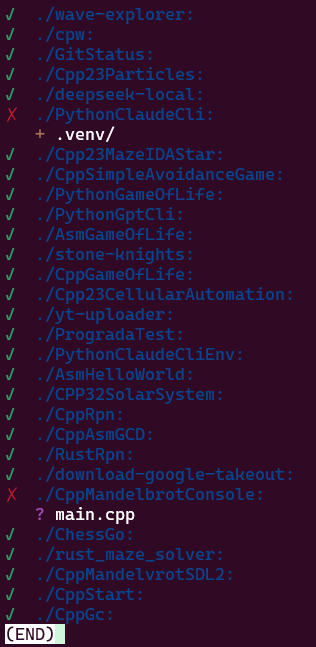

# Git Status in Subfolders

This Python script (`git-status.py`) provides a convenient way to check the `git status -s` of all Git repositories located in the immediate subfolders of a specified directory. It enhances the output with color-coding for better readability and minimizes unnecessary whitespace.

## Demo



## Features

* **Iterates through Subfolders:** Recursively checks only the first level subdirectories.
* **Git Status Display:** Executes `git status -s` in each subfolder that is a Git repository.
* **Color-Coded Output:** Uses ANSI escape codes to colorize output for improved clarity:
  * ✓ Green checkmark for clean repositories
  * ✗ Red X for repositories with changes
  * ＋ Yellow for untracked files
  * ➕ Green for added files
  * ✎ Magenta for modified files
  * ✖ Red for deleted files
  * ➜ Cyan for renamed files
  * ⧉ Cyan for copied files
* **Clean Status Indication:** Explicitly indicates when a repository is clean.
* **Command-Line Arguments:** Accept folder path as argument with tilde expansion support.
* **Error Handling:** Includes error handling for non-existent directories, Git command failures, and the absence of the Git command.
* **Clear Messages:** Provides informative messages for Git repositories, non-Git directories, and errors.
* **Whitespace Optimization:** Reduces vertical whitespace in the output for a more compact display.

## Requirements

* Python 3.x
* Git (must be installed and accessible in your system's PATH)

## Installation

### Quick Install (Recommended)

1. Clone the repository and run the installer:
    ```bash
    git clone https://github.com/yourusername/PyGitStatus.git
    cd PyGitStatus
    ./install.sh
    ```

2. The installer will:
    * Create a symlink from `~/bin/status` to `git-status.py`
    * Make the script executable
    * Check for Python 3 and Git dependencies
    * Provide instructions if `~/bin` is not in your PATH

### Manual Installation

1. **Save the script:** Save the Python code as `git-status.py`.
2. **Make it executable (Linux/macOS):**
    ```bash
    chmod +x git-status.py
    ```
3. **Add to PATH:** Either copy the script to a directory in your PATH or create a symlink.

## Usage

### Basic Usage

```bash
# Check current directory
status

# Check specific directory
status ~/work

# Check with explicit current directory
status .

# Show help
status --help
```

### Command-Line Arguments

The script accepts one optional argument:

* `folder` - The directory to scan for Git repositories (default: current directory)

### Examples

```bash
# Check all git repos in your work directory
status ~/work

# Check repos in /home/user/projects
status /home/user/projects

# Check current directory
status
```

## License

MIT License
